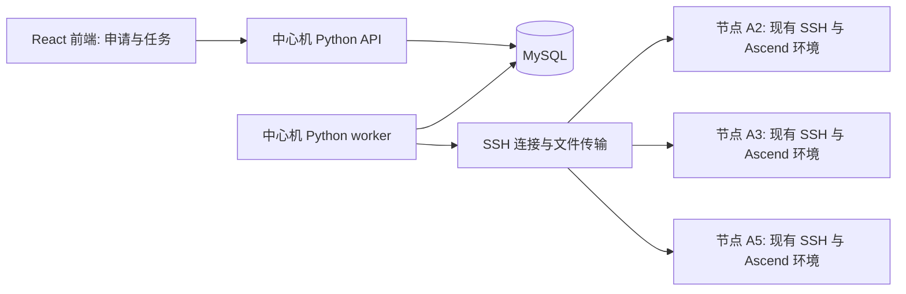

# Hive NPU 集群管理与任务执行设计

状态：设计 v6，已获用户授权进入实现。更新日期：2026-09-12。实际完成项与验收边界见 [实现记录](implementation.md)；下文保留设计阶段的决策与目标规格。

## 1. 已确认架构

**React 前端 + 中心管理机 Python/Bash + MySQL，通过 SSH 管理和执行 NPU 节点任务。** 不使用 Slurm，不安装 slurmd，也不在节点部署 Hive 常驻 agent、监控服务或任务守护进程。MySQL 是平台资源分配记录的唯一权威来源，中心管理机完成采集、排队、按卡分配、任务下发和清理。

支持两种入口，共用资源申请能力：申请 IP/卡后手工 SSH 调试；在前端提交任务，由中心机自动选择可用节点和卡，通过 SSH 执行。NPU 按 A2/A3/A5 分类，设计阶段假设管理命令统一兼容；机型固定卡配置全部可用，平台维护卡 ID 及其占用，显存和命令 ID 映射从采集结果核对。

手工调试申请交付后保护 30 分钟，防止准备期间重复分配；保护结束后，申请卡最近连续 10 分钟 AI Core 全为 0，即可清理相关进程并释放。前端提交的平台任务按执行状态和任务时限管理，构建环境时 AI Core 为 0 不触发调试回收规则。

默认共享 root SSH，假设用户遵守分配卡的使用规则。允许平台管理 SSH 账号/凭据和清理申请进程；清理限定申请卡及相关进程，不要求实现强制用户隔离。当前只确定设计，尚未连接或修改真实节点。

平台提供只输入用户名的登录页，用于记录谁申请、谁提交任务和谁执行操作，不要求密码。平台用户名与节点 root 账号分开；这是团队内部的身份自报，不验证真实身份。模块通过明确接口协作，硬件差异与指标定义集中管理，保持现有轻量部署方式。

## 2. 首版能力与复用接口

| 能力 | 首版内容 | 可复用边界 |
|---|---|---|
| 用户登记 | 用户名登录、退出、当前用户、操作归属 | Identity 为申请、任务和审计共用 |
| 集群管理 | IP/root 密码台账、机型/卡 ID、健康、互联与共享盘检查 | Inventory 为申请和执行共用 |
| 资源申请 | 按 A2/A3/A5、显存、数量筛选；整机或指定数量卡；并发排他登记 | ResourceService 为调试、环境准备和未来任务共用 |
| 实时信息 | 所有节点按卡展示进程、实际容器名、HBM、AI Core、登记与实际占用 | Telemetry 提供统一快照和历史 |
| 回收判断 | 30 分钟保护 + 最近 10 分钟 AI Core 全零 → 清理并释放 | LeasePolicy 输出回收决定，独立清理模块执行 |
| SSH 管理 | 默认 root 登录，允许管理账号/凭据、清理申请进程 | 按申请卡和关联进程限定操作范围 |
| 任务执行 | 前端提交脚本、中心机分配节点并 SSH 执行、日志/结果/取消 | Execution 调用同一 ResourceService |
| 后续自动化 | PR、构建环境、e2e、nightly、weekly | Trigger 复用既有任务提交接口 |

“部分卡”指从机型固定卡配置中申请若干卡，假设所有卡均可用，不引入额外的“可调度设备数”或卡内虚拟切片口径。内部保留该机型的卡 ID 与 NPU 命令 ID 映射，以正确查询和执行。

## 3. 中心管理架构与模块

中心机运行一个 Python 代码库中的 API 和 worker 两个进程，可用本机 systemd 管理；部署一份 React 静态产物和一个 MySQL 实例。worker 使用标准库线程池做有界 SSH 并发，负责周期采集、分配、任务调度和清理，无消息队列或微服务拆分。

计算节点只需要已有 SSH 服务、Bash/基础系统命令和 Ascend 业务环境。采集/检查脚本通过 SSH 临时执行，结束即退出；任务运行时只有该任务的 Bash 包装脚本和业务进程，完成后退出。不要求为 Hive 在每台机器安装 Python、开启 HTTP 端口或配置常驻服务。

| 模块 | 责任 | 复用方式 |
|---|---|---|
| Identity | 用户名登记、会话、当前操作者 | API 统一取得 Actor，不由各页面自行填写申请人 |
| Inventory | IP/SSH 凭据、代际/机型、卡映射、显存和维护状态 | 申请/执行共用 |
| HardwareAdapter | 枚举设备、解析硬件指标/进程、生成设备探测与启动配置 | 首版 Ascend，A2/A3/A5 差异在适配器内部处理 |
| MetricCatalog | 指标定义、单位、展示和聚合规则 | 采集、存储、页面和统计共用同一份定义 |
| AdmissionProbe | 纳管时的节点互联与共享盘检测、分配前复验 | 通过已有 SSHClient 执行，无常驻组件 |
| SSHClient | 连接复用、命令执行、SFTP、超时与重连 | 所有节点操作共用 |
| ResourceService | request/get/cancel/release；整机/按卡锁、排队 | 调试和自动任务共用 |
| Telemetry | 调用硬件适配器，经 SSH 批量采集、校验与入库 | 页面与回收共用 |
| LeasePolicy | 30 分钟保护、10 分钟全零判断 | 纯 Python 函数，不直接执行远端操作 |
| AccessAndCleanup | SSH 账号管理、按申请停止进程、释放复核 | 手工调试和自动任务共用 |
| Execution | 上传脚本、启动、查询、取消、日志/结果拉取 | 前端任务的基础执行能力 |
| Reconciliation | MySQL 意图与节点任务记录/实际进程对账 | SSH 断线和中心机重启恢复 |
| Trigger | 后续 PR/nightly/weekly 生成执行请求 | 不直接分配 IP/卡 |

节点地址、凭据和卡号以结构化字段传递；用户任务正文上传为脚本文件执行，不拼接进管理命令。业务状态、事务和解析使用 Python，节点动作使用短 Bash 脚本。

### 3.1 模块隔离与数据归属

隔离以 Python 包及接口为单位，仍部署一个代码库中的 API 和 worker，不增加模块间 HTTP、消息中间件或独立数据库。应用启动时注入依赖；API 负责会话、输入校验和调用，worker 负责周期与重试，业务规则留在所属模块。

| 数据与规则 | 唯一负责模块 | 其他模块如何使用 |
|---|---|---|
| 用户、会话、Actor | Identity | 接收稳定 user_id 和本次用户名快照 |
| 节点、凭据引用、设备身份与能力 | Inventory | 查询结构化库存；凭据仅交给 SSHClient |
| 当前/历史指标、进程观测与聚合 | Telemetry（按 MetricCatalog 定义） | 查询快照/窗口及有效性，不读取厂商原始输出 |
| 请求、队列、分配与卡锁 | ResourceService | 调试、Execution 共用 request/get/cancel/release |
| 回收判断 | LeasePolicy | 输入分配信息与指标窗口，输出保留/清理/未知及证据 |
| 远端清理事实 | AccessAndCleanup | 接收确定的目标及分配版本，返回核验结果；不直接解除卡锁 |
| 任务、尝试、日志和结果 | Execution | 调用资源与远端操作接口，不自行选择卡或修改归属 |
| 互联与共享盘检测 | AdmissionProbe | 纳管和分配前复验共用同一检测结果格式 |

各模块只写自己负责的表；跨模块读取走查询接口。ResourceService 独占分配/释放事务，收到清理成功证据后才解除归属。Reconciliation 通过所属模块接口修复状态，不成为绕过规则的第二个写入入口。审计使用统一的记录接口，关键状态事件与业务变更在同一 MySQL 事务提交。

接口返回结构化结果，至少区分成功、不满足条件、暂时不可达、未支持、结果未知，并携带原因及观测时间。远端有副作用的操作必须带 operation_id、分配版本及明确目标；SSHClient 不自行重试结果未知的启动/清理动作。SSH 并发名额分别留给采集和任务/清理，单节点超时不能阻塞全部节点，任务长时间执行不占住采集线程。

React 按登录、集群、申请、节点、任务组织页面模块，共用请求客户端、会话、资源规格表单、卡列表和指标展示模块。前端只展示服务端给出的状态和原因，不再实现一套分配/回收判断；状态枚举和字段契约统一维护。

### 3.2 硬件扩展接口

核心资源统一使用 node_id/device_id，以及 `vendor、device_kind、generation、model、memory_bytes、capabilities`。device_id 是平台稳定标识；厂商卡号、芯片号和命令 ID 由适配器映射，不能把 Ascend 命令 ID 写进通用分配逻辑。首版规格表单仍只提供 Ascend A2/A3/A5，整机/按卡语义保持不变，不新增物理卡数指标。

HardwareAdapter 提供设备发现、指标/进程解析、互联探测和任务设备配置几个接口。它通过注入的 SSHClient 执行短命令并返回统一 Device/Sample/Process/ProbeResult，不访问 MySQL，也不决定申请归属。Docker 进程归属与共享盘发现是通用能力，不复制到各代际适配器中。

首版用一个 Ascend 适配器和内部代际配置复用通用命令；A2/A3 互联差异集中在这里，A5 未验证的能力返回 unsupported。将来增加其他硬件时注册适配器及机型配置，分配、队列、会话和任务状态机保持复用。核心逻辑按已声明能力筛选，未知机型或缺少必要采集/清理能力的设备可以展示，但不能被当作可安全自动分配/回收的资源。

AI Core 全零是 Ascend 调试回收的明确政策，不自动把其他厂商任意“利用率”套入该规则。新硬件须明确相应的活跃指标、完整采样要求、进程映射和释放核验方式；未提供时标记自动回收不支持，保持已分配资源并提示处理。支持某类硬件不代表默认支持其所有互联或回收能力。

### 3.3 指标扩展接口

MetricCatalog 是代码库中的声明式指标清单，无独立注册服务或动态插件系统。每个指标定义稳定 key、定义版本、中文名称、作用对象（节点/设备）、数值类型、标准单位、适用硬件/能力、采集周期、展示方式、聚合方法及保留策略。首版只注册第 9 节已列出的指标，不因提供扩展入口就扩大采集范围。

观测统一包含对象 ID、metric_key、value、observed_at、采样批次、定义/适配器版本及 quality/reason。正常零值、unsupported、采集失败、过期和未知必须区分。Telemetry 负责单位校验、质量与时窗，硬件适配器只负责取得并解释原始数据；厂商特有指标使用命名空间，不能把不同含义的数据写入同一 key。

AI Core/HBM 等高频核心指标保留固定类型列；可选扩展数值指标按同一对象/采样批次存入 JSON 扩展列，避免每个标量一行。最新值、原始样本和聚合分别保留扩展列及定义版本。聚合只执行指标清单声明的规则，例如时间加权均值、最大值或计数器增量；未定义规则的指标仅展示最新值，不默认求平均。单位或含义变化须换定义版本或新 key，历史不得静默混算。

前端读取指标描述和统一查询结果生成可选列/曲线；新增普通数值指标通常只需增加定义和采集映射。需要特殊交互或复杂统计的指标可增加专用展示/聚合实现，并在清单中声明，避免把复杂语义硬塞进通用配置。新增指标默认只用于观察，只有显式修改并验证策略后才能参与分配或自动回收。

扩展注册使用普通 Python 映射/工厂，标准库类型或现有校验工具表达接口，不引入插件框架、依赖注入框架或新数据库。指标采集、硬件适配、资源分配、回收政策与任务执行可分别通过各自接口验证和替换实现。

## 4. 前端页面

### 4.0 用户名登录 `/login`

页面只包含用户名输入框和“进入平台”按钮，不需要密码、注册流程或验证码。首次提交创建用户，之后相同用户名进入同一用户记录。用户名去除首尾空白后不能为空，限制为 1–64 个字符，不允许控制字符；保留大小写并按精确值唯一匹配，MySQL 唯一约束使用相同的比较规则，不能让数据库默认排序规则把不同用户名意外合并。

登录成功后中心机签发随机、不透明的会话 Cookie（HttpOnly、Secure、SameSite=Lax），MySQL 只存令牌哈希、user_id、创建/到期/撤销时间；会话有效期 24 小时。前后端同源部署，状态变更使用 POST 等写接口并校验来源。页面刷新通过 `GET /api/session` 获取当前用户；无会话时进入登录页，登录后返回原页面。`POST /api/session` 登录，`DELETE /api/session` 退出；退出只撤销当前会话，不释放机器或取消任务。

页面右上角始终显示当前用户名和退出入口；申请表显示“申请人：当前用户”，不提供另填申请人的输入框。API 从会话生成 Actor，写入 request/execution 的 owner_user_id 和提交时用户名快照，忽略或拒绝客户端伪造的 owner 字段。后台继续执行时仍保留原申请归属，自动操作另记 system 操作者；切换账号或会话过期不改变旧申请与统计归属。同一用户名并发首次登录由唯一约束合并为同一用户。

用户名可被他人输入，因此该页用于协作登记，不能证明操作者就是某个人。既有“本人申请/管理员”等界面规则按登记身份执行，管理员名单由中心配置指定，首版不新增角色管理页面；这些规则也不能提供经过身份验证的权限保证。后续如需验证身份，只替换 Identity 登录方式，继续使用稳定 user_id，资源与任务模块不依赖密码或具体认证协议。

### 4.1 集群管理 `/clusters`

机器表显示集群、节点名、IP、SSH 端口、root 密码操作、A2/A3/A5 代际/机型、驱动/固件/npu-smi、每卡显存、空闲/已申请/实际占用卡数、申请人列表、健康、互联检查、共享盘挂载路径和最后检测时间。不列“物理卡数/可调度设备数”，不采集裸机 CANN 和业务依赖版本。

纳管时检测新节点与已有节点的互联关系，以及 `/mnt` 下是否有共享盘；显示已通过/失败/待确认、对端与原因，支持手动复查。互联或共享盘未通过不妨碍作为单机资源纳管，申请需要这些能力时才作为筛选条件。

管理员可纳管、维护、编辑密码、更新库存和查看审计。整机维护阻止该节点全部新申请，已有活动不自动结束。单卡故障可以只阻止故障设备，但若故障影响整板/整机则按依赖组隔离。

SSH 账号可管理，默认 root 密码以机器为单位存储，列表默认掩码。管理员及对该机器有有效申请的用户可受控查看；查看/复制记录审计，接口 no-store，不进入列表导出或日志。释放某次申请不修改 root 密码，以免影响同机其他人；之前已获知密码也不会因平台记录释放而失效。

### 4.2 机器/卡申请 `/requests`

表单：代际/机型、整机/部分卡、机器数、每机申请卡数、每卡最小显存、主机规格、用途、是否排队及等待期限。机器数大于 1 时增加“需要多机互联”开关，默认不勾选；勾选后只分配已经通过互联检测的机器/卡组合，不满足则排队或失败。单机时不显示该开关。部分卡默认在每台机器内满足数量，不把不同机器的零散卡合成一个单机申请；多机数量与每机卡数分别表达。

返回申请 ID、IP、root 账号/密码、代际/机型、**分配的卡 ID**、显存、交付时间、保护结束时间、使用状态、互联检查结果和各节点共享盘路径。命令需要的逻辑 ID 映射可在卡详情查看。提供按分配卡号生成的启动提示；可见设备环境变量仅为使用便利，不充当 root 的权限边界。

例如一台 8 卡机器：甲申请卡 0–3，乙可申请 4–7，平台不会再把 0–3 分给乙；甲实际运行在 4 上属于申请外使用，观测发现后提示冲突，无法从 root PID 直接判定操作者就是甲。

首版一个请求的已交付设备集合作为一个保留单元，不在运行中自动拆散申请内的卡。申请 4 张且其中一张仍忙时保留这 4 张，另外未被申请的卡仍可分配。整机申请要求节点全部设备可用且没有部分卡申请；部分卡和整机申请互斥。后续若要缩小已交付集合，另加显式部分归还协议，不能悄悄改变用户取得的卡集合。

### 4.3 所有节点实时信息 `/nodes/`

默认展示**全部纳管节点**，不限定当前用户申请过的机器。按节点分组展开卡列表，支持按 IP、代际/机型、卡状态、申请人和 Docker 容器名搜索筛选；分页覆盖全量节点，顶部统计按整个筛选结果计算。`/nodes/:id` 仅作为可选的单机详情入口。

每个节点显示 IP、机型、卡占用概况、互联检测结果和共享盘；每张卡显示卡 ID、AI Core 当前值/10 分钟趋势、显存已用/总量、PID 及**实际 Docker 容器名**、健康和最后采样时间。多个 PID/容器使用同一卡时全部列出，不只保留一个名称。

“平台登记”和“实际运行”分开展示：登记列显示申请人/申请 ID/保护期；运行列显示宿主机 PID、Docker 容器名或“宿主机进程/未识别”。无申请但检测到业务 PID、计算或超出正常无业务基线的显存占用，显示“平台外占用”，继续展示实际进程和容器，不能因缺少申请记录就显示空闲。 管理员仅能在无申请、无 PID、AI Core=0 且采集完整时确认驱动空闲显存基线；已确认的 Ascend 基线允许 2 MiB 读数波动，分配和归还使用相同上限，未确认或其他硬件不默认获得容差。节点重启使已确认基线失效。

默认 15 秒刷新，图表明确缺测区间。容器名仅用于识别实际运行环境，不据此猜测申请人身份。实例：`IP 10.x.x.x · 卡 2 · 平台未申请 · PID 1234 · 容器 debug_alice · AI Core 80%`。

### 4.4 任务中心 `/tasks`

当前展示决策：任务中心暂时隐藏，不出现在导航，直接访问该路径返回实时信息页。以下能力的代码和后端接口保留，等待后续开放入口。

前端提交任务名称、Bash 脚本/命令、资源规格、工作目录、环境变量和执行时限；中心机选择可用节点/卡，通过 SSH 下发。页面显示排队、准备、执行、收集、清理状态，实际 IP/卡 ID、开始/结束时间、退出码、日志与产物，支持取消任务。

资源不足时排队，不要求用户先手工选 IP。任务与手工调试使用同一份卡归属，不能互相重叠。PR/commit、环境模板、JUnit 用例结果及周期计划在后续增加。

## 5. 中心机资源申请与排队

ResourceSpec 包含 vendor/device_kind（首版固定 Ascend/NPU）、代际/机型、整机/部分卡、机器数、每机申请卡数、每卡最低显存、必要能力、`require_interconnect`、必要主机规格，以及 `purpose=debug|task`。任务模板若必须使用共享盘，另携带所需 shared_storage_id/访问模式；普通申请只展示盘信息，不强制要求有共享盘。同一申请的卡集合作为整体保留和释放，整机申请与该节点已有部分卡申请互斥。用户归属由 Actor 单独提供，不放入可由客户端指定的硬件规格。

1. 前端提交请求，API 从有效会话取得 user_id，校验规格及幂等键，调用 ResourceService 写 MySQL；相同 user_id 的相同幂等键不会重复分配。相同键但正文不同返回冲突，不复用错误的资源结果。
2. worker 根据机型卡列表和最新 SSH 采集结果，筛选代际/显存符合、健康、无占用的卡；勾选多机互联时按完整候选机器/卡集合验证连接关系，不只检查每台机器有一个“可互联”标签。选择排队时按代际资源池及提交顺序处理；不排队请求独立尝试一次，不被等待中的大请求阻塞。不实现复杂抢占或公平份额调度。
3. MySQL 事务先按固定顺序锁节点闸门，再锁设备库存行，重新检查可用状态与采样版本，写入唯一的当前卡归属。多机请求一次锁定全部所需资源，数量不足则继续等待或按用户选项失败，不交付半套资源。
4. 提交事务后，经 SSH 对候选节点和卡再次检查，复验已勾选的互联要求和模板需要的共享盘访问；此时卡已预占，其他请求不能取得。检查失败则记录原因、核验无未完成远端操作后撤销预占。不能持有数据库事务等待 SSH。
5. `debug` 返回 IP、SSH 凭据和精确卡 ID，交付时启动 30 分钟保护；`task` 将同一 allocation 交给 Execution，上传并启动任务。自动任务不再额外创建一个占位进程或第二次申请资源。

设备库存行预先存在，设备当前归属以 device_id 唯一约束；节点闸门协调整机和按卡并发，allocation_epoch/version 阻止旧释放动作影响新申请。实际卡号从被锁定的设备记录获得，并与 SSH 枚举映射复核，不能用“申请数量”猜测卡 ID。

启动前预占有独立的准备期限，超时后先确认没有远端任务仍在执行或等待启动，再撤销。普通排队截止时间由请求指定，未指定时持续排队并允许用户取消；不增加复杂的首版参数表。

CPU/主机内存只作为机器规格或可选预算，部分卡申请不承诺独享全部主机资源。首版同代际 FIFO 可能让小请求等待前面的大请求；这是简化实现的取舍，之后有需要再增加队列策略。

## 6. 保护与回收规则

申请交付后保护 30 分钟，期间不自动回收。保护结束后，按申请卡集合最近 10 分钟的 AI Core 使用情况决定保留或清理，满足条件即可开始清理。

### 6.2 判断依据

**申请涉及的所有卡，最近连续 10 分钟 AI Core 采样都为 0，就可以清理申请进程并释放；有 PID 或显存占用不再阻止触发清理。** 任意申请卡在这段时间出现大于 0 的 AI Core 使用率，则保留整个申请集合。同机其他申请的卡不参与本次判断。

使用最新且完整的 10 分钟采样窗口；缺测、采集失败、掉卡或重启期间不能当成 0，恢复后重新形成完整窗口。这里是采用用户确定的闲置回收策略，不是把 AI Core=0 判定为进程已经死亡。CPU 构建/下载或打开 SSH 会话不单独触发自动续占；未来平台下发的自动任务按任务生命周期管理，见第 13 节。

### 6.3 简化判断逻辑

| 条件 | 处理 |
|---|---|
| 交付未满 30 分钟 | 保留申请 |
| 已满 30 分钟，最近 10 分钟任意申请卡 AI Core > 0 | 保留申请 |
| 已满 30 分钟，全部申请卡最近 10 分钟 AI Core 都为 0 | 清理申请进程，确认资源释放后归还卡 |
| 监控不完整，或清理失败 | 暂不重新分配，记录原因并重试/处理 |

### 6.4 例子

| 场景 | 结果 |
|---|---|
| 10:00 交付 0–3，10:20–10:30 的完整采样全为 0 | 10:30 可开始清理，完成后释放；无需再等 10 分钟或另等 5 分钟 |
| 半小时后还有 PID，但最近连续 10 分钟 AI Core 全零 | 结束申请相关进程，确认设备释放后归还 0–3 |
| 11:00 后不再计算，但 PID 仍在 | 完整零使用窗口达到 10 分钟后可清理，不因 PID 存在永久保留 |
| 甲的 0–3 连续 10 分钟全零，乙的 4–7 正在运行 | 只清理甲的申请，不影响乙 |
| 一次申请 4 张卡，其中一张最近 10 分钟有计算 | 保留本次申请的 4 张卡 |
| 监控中断或节点重启 | 保留卡锁，恢复后重新收集完整窗口 |

## 7. SSH 管理与申请进程清理

**允许平台管理 SSH 账号和清理申请进程。** 当前默认仍可使用共享 root，假设大家遵守申请卡的使用规则。SSH 管理包括账号登记、凭据配置/更新、连接校验，以及需要时创建或停用独立账号；无需为首版强制切换个人账号或建设强制卡隔离。

清理流程：将申请标记为 RELEASING 并保留卡锁 → 复核保护期与最近 10 分钟 AI Core → 通过 SSH 查询申请卡上的进程及可关联子进程 → 再次核对 PID/启动时间和涉及卡集合 → 先请求退出，未退出的相关进程再强制结束 → 复查设备进程与显存释放情况 → 确认远端相关进程已结束，再以 MySQL 事务释放卡锁，完成归还。

在用户遵守卡分配规则的前提下，申请卡上的 NPU 业务 PID 可以作为本次清理目标；不要求必须由平台启动，root UID 也不是排除条件。没有平台申请的直接 SSH/Docker 使用记为平台外占用，禁止被新申请覆盖，但不自动套用申请到期规则杀掉它；管理员可单独发起明确范围的清理。清理关联的 CPU 子进程需确认其属于该申请进程树，不根据 root UID 或宽泛进程名全机清理。若一个进程还涉及其他申请的卡，或无法确认清理范围，则标冲突待处理，不影响其他申请。清理前刷新实际 PID/容器关联，不根据容器名字批量 docker stop/kill；容器还有其他任务时只处理本申请进程，容器重启策略导致进程重新出现则清理未完成，卡不重新分配。

开始清理前若发现新计算活动，撤销自动回收并继续保留；监控失效也暂缓。清理后目标卡不得再有业务进程，显存应回到设备正常无业务状态；驱动正常保留的显存不要求为零。残留进程、显存异常或 SSH 清理结果未知时，保持卡不可分配并记录原因。

共享 root 密码更新按整机管理，不作为每次按卡释放的必经操作，以免影响同机其他用户。仅结束可关联本次申请的会话/进程，不批量断开同机 SSH，不重置整机 NPU。主动归还表示用户要求结束本申请，可以直接进入同一清理流程，不必等待 10 分钟空闲；归还前必须完成清理核验。

本轮只修改设计文档，不实际操作 SSH 账号或终止服务器进程。

## 8. 状态与故障恢复

申请状态：REQUESTED → PENDING → RESERVED → ACTIVE → RELEASING → RELEASED；异常为 UNKNOWN、CONFLICT、FAILED。FAILED 不自动释放卡，涉及远端启动/停止的操作结果必须先核实。

任务状态：QUEUED → PREPARING → STARTING → RUNNING → COLLECTING → CLEANING → SUCCEEDED/FAILED/CANCELLED；连接或执行结果不明时标 UNKNOWN。任务退出码和资源清理结果分开记录，测试通过但清理未完成时不能把卡交给下个申请。

设备登记与观测分开：allocation/申请人/保护时间是登记；计算活跃/有 PID/空闲/未知是观测。最终状态优先级为维护/故障 > 未知/冲突 > 已申请 > 外部占用 > 可申请。节点展示各状态卡数和申请人集合，不设置唯一 node_owner。

MySQL operations 保存每次远端操作的 ID、所属申请/任务、attempt、状态、重试信息。首版一个主动 worker 负责资源变更，有界并发执行不同节点操作；超时不会直接生成新任务。节点任务目录的启动锁、取消标记和状态文件支持 SSH 重试去重，详见第 12 节。

| 情况 | 处理 |
|---|---|
| SSH 采集失败 | 标缺测，不能当作 AI Core=0；已申请卡保持占用 |
| 启动命令发送后响应丢失 | 先按 execution_id/attempt 查询节点记录和真实 PID，结果不明时保持 UNKNOWN 并记录启动未确认，不重复运行脚本 |
| 中心机或 MySQL 重启 | 已脱离 SSH 的任务按自身时限继续运行；恢复后扫描未完成记录，通过 SSH 重连查询，不凭旧快照释放 |
| 节点重启、任务 PID 消失且无退出记录 | 标任务结果未知/失败，核验 boot_id 和设备状态；不能当作成功，也不自动重跑有副作用的任务 |
| 取消请求暂时无法送达 | 保持取消中和卡锁，恢复连接后停止并复核，不提前归还 |
| 清理已完成但数据库提交失败 | 按同一操作 ID 重试确认，CAS 匹配 allocation_epoch，不能删除新申请的锁 |

任何卡只有在节点可达、数据新鲜、设备健康、无有效整机/设备锁、无实际占用，并满足请求的互联/共享盘约束时可交付。恢复后的调试自动回收仍需重新形成完整 10 分钟窗口。

## 9. 指标与记录字典

本节列明计划展示、参与决策或历史统计的字段；首版以外字段显式标为后续。未支持的指标为 NULL + 原因，不使用 0 代替。所有百分比存 0–100，容量统一存 bytes、前端按 GiB/MiB 展示，时间数据库用 UTC，前端默认 Asia/Shanghai。设备内存按采集器版本记录原始单位和转换规则，不混合 DDR 与 HBM。

### 9.1 机器与纳管信息

| 信息 | 保留字段与用途 |
|---|---|
| 机器连接 | 节点 ID、IP、SSH 端口、账号、密码引用 |
| NPU 规格 | A2/A3/A5 代际、机型；机型决定固定卡配置 |
| 卡 ID | 按机型约定的卡列表，内部保留命令所需 ID 映射；用于按卡申请/监控/清理 |
| NPU 显存 | 每卡类型与总容量，用于规格筛选 |
| 裸机 Ascend 基础信息 | 驱动、固件、npu-smi 版本；不采集裸机 CANN、HCCL、torch/torch_npu 等业务依赖 |
| 多机互联 | 对端节点/卡、NPU 网络地址、主机/NPU 检测结果、检查时间及失败原因 |
| 共享盘 | 挂载路径、来源、文件系统、读写权限、所属共享组、验证状态/时间 |
| 纳管状态 | 启用/维护、库存与卡号映射更新时间 |

删除“物理卡数”和“可调度设备数”两个独立指标。默认每个机型的卡全部可用，平台按卡 ID 记录占用；申请表的“每机申请卡数”只表示这次要几张卡。例如某机型固定有 8 张卡，本次申请 2 张，平台从没有申请锁且实际空闲的卡中选择 2 张。实时可申请卡数是当前空闲卡的计数，不是另一个硬件规格字段。

CPU 架构/核数/主机内存仅保留可选申请条件。裸机不做业务环境依赖盘点；未来某个任务模板需要 CANN 或框架时，可对该任务运行环境做准备/检查，不扩展为全量裸机版本统计。共享盘只检查挂载及可访问性，不扫描用户文件目录。

### 9.2 NPU 实时指标与进程容器

| 指标 | 展示与用途 |
|---|---|
| AI Core 利用率 | 每卡当前值、最近 10 分钟趋势及是否全零 |
| 显存占用 | 每卡已用/总量及比例，清理后核验释放 |
| 实际进程/容器 | 每卡宿主机 PID、进程简称、Docker 容器名/ID；无容器显示“宿主机”，无法识别显示“未识别” |
| NPU 健康 | 正常/故障和错误信息 |
| 平台登记 | 所属申请、申请人、申请卡集合、保护结束时间、清理/释放状态；无登记明确显示“平台未申请” |
| 实际占用 | 空闲/计算中/有进程/平台外占用/未知，不以平台登记代替运行事实 |
| 采集状态 | 最后采样时间、10 分钟窗口是否完整及异常原因 |

原独立进程明细表合并到这里。为正确清理，内部仍保存 `(node_id, boot_id, host_pid, start_time)`、关联卡 ID、完整 container_id、采样时的 container_name、任务/申请关联和映射结果；这些是去重与防止误操作的技术字段，不再单独做一章或页面。容器名可变，以完整容器 ID 识别；同名但 ID 不同不能当成原容器。

Docker 查询失败、PID 消失或映射不确定显示“未识别”，不能当作无进程；支持平台外用户直接 SSH 启动的容器。进程数受工具输出限制时标“至少 N 个”，不把列表截断说成完整结果。显存总占用不要求等于 PID 显存之和。[npu-smi 进程显示说明](https://info.support.huawei.com/enterprise/zh/doc/EDOC1100493502/a23468a4)

首版不增加 CPU 负载、主机 I/O、温度/功率或业务依赖版本监控。采样批次、卡映射版本和分配版本只作内部校验字段。

### 9.3 申请与审计事件（每次变化持久化）

记录 request/attempt/idempotency ID、owner_user_id、提交时用户名快照、purpose、完整 ResourceSpec、策略版本、创建/排队/资源锁定/交付/保护结束/清理开始/清理完成/释放确认时间、分配节点及设备、job 标识、状态前后值、操作者 user_id/用户名快照（自动操作为 system）、原因码、失败详情。用户名展示在申请列表、卡归属、任务详情和操作记录；按用户统计以稳定 user_id 分组，首版不引入项目/成员关系。

每个回收决策记录保护结束时间、10 分钟窗口起止、采样完整性、每卡 AI Core 是否全零、清理目标 PID/启动时间、涉及卡、清理结果和释放结果。相同结论持续不变只更新最后评估时间及计数；转态和关键证据变化写事件，避免每 15 秒生成无意义审计日志。

审计包括登录、凭据查看/复制/轮换、互联探测/共享盘验证、纳管/维护变更、申请/延期/取消/释放、管理员强制结束、策略修改、自动判断、SSH 操作、进程清理及空闲复核结果；手工 root SSH 操作者不保证能还原。记录对象 ID、操作者、时间、结果、来源 IP 和 correlation ID；不记录密码/令牌正文。

### 9.4 历史汇总与公式

| 指标 | 定义、分母与展示 |
|---|---|
| 实时机器/设备总数、可申请/分配/故障/未知数 | 按第 8 节优先级计数；按型号分组，不能把不可申请的闲卡算可用 |
| 队列等待时长 | 资源实际锁定时间 − 请求提交时间；未分配显示已等待时长；取消/失败独立统计 |
| 交付耗时 | delivered_at − 资源实际锁定时间；含设备复核与交付 |
| 申请交付使用时长 | release_started_at − delivered_at；释放确认耗时另列 |
| NPU 占用设备小时 | Σ该申请实际锁定设备数×持有区间秒/3600，含准备和释放确认等待；不因申请整台 IP 而把未分配卡算给用户 |
| 集群机器占用小时 | 按节点上所有有效申请区间的并集积分，同机多人不重复计；个人显示触及节点时长，明确该值不能相加得到集群占用 |
| 资源分配率 | 已分配设备秒 / 启用且非维护的设备秒；故障在该分母内并单列故障率；另给健康可调度容量口径，不混用 |
| AI Core 平均/峰值 | 对有效设备采样做时间加权；峰值取 max；按 A2/A3/A5 代际单列，跨代际整体仅为设备时间平均、不代表 FLOPS |
| 计算活跃设备小时 | Σ有效设备采样区间秒×I(util>0)/3600；估算值，不是进程运行时间 |
| 已分配期间 AI Core 平均 | 仅分配设备有效区间，Σ(util×seconds)/Σ(valid seconds)；同时显示覆盖率 |
| 分配未计算比例 | 已分配有效样本中 util=0 的设备秒占比；用于观察闲置情况，不证明进程已经死亡 |
| HBM 平均/峰值占用 | bytes 时间加权均值/峰值；池化比例用 Σused/Σtotal，不平均不同容量卡的百分比 |
| 进程存在时长 | 有确切业务进程的有效采样区间之和；未知区间单列，不能补零 |
| 保护/清理/释放确认/冲突时长 | 对状态事件区间积分；不根据 GPU/NPU 利用率反推状态 |
| 自动保留/自动清理释放/主动归还/清理失败次数 | 按状态转换事件计数；持续保留不每轮加一 |
| 申请成功率 | 已交付请求数 / 非取消且已有终局结果的请求数；处理中不计，用户取消单列 |
| 采集覆盖率/未知率 | 实际有效设备秒 / 应采设备秒；资产在有效纳管区间才进入分母 |
| 任务成功率及阶段耗时 | 按终态与构建/执行/收集/清理阶段记录；失败、超时、取消分开 |
| 用例 passed/failed/skipped/error、duration（后续） | 解析 JUnit XML；缺报告属于收集失败，不能算全通过 |

积分时每个样本只覆盖至下一样本或最多一个额定采样周期，缺测不得前向填充整个空档。1 分钟/1 小时聚合保存 `sum(value×valid_seconds)、valid_seconds、expected_seconds、min、max、active_seconds`，再聚合时不能简单平均平均数。原始点、聚合点及阈值版本保持可追溯。

互联和共享盘只记录最近检测及变化事件：互联保留源/目标节点和卡、NPU 地址、方向、主机 TCP/NPU/TLS 结果、时间和原因；共享盘保留各节点路径、来源/类型、可访问性、权限、总量/剩余空间、共享组与交叉验证结果。它们不是 15 秒全量时序指标。进程记录同时保存观测当时的 Docker 名称/ID，平台外占用纳入集群真实利用率，不能伪造个人申请时长。

## 10. MySQL 数据与存储

MySQL 只使用平台业务库 `hive`，保存库存、卡归属、观测、任务与持久化操作。不设置其他调度系统的 accounting 数据库。

| 表组 | 关键表/约束 |
|---|---|
| 身份 | users（稳定 ID、唯一用户名、创建时间、最后登录时间）、sessions（随机 token 哈希、user_id、创建/到期/撤销时间）；不存平台密码或密码哈希，不引入首版 projects/memberships |
| 台账 | clusters、node_models、nodes、devices、inventory_versions；机型维护固定卡 ID 配置，设备保存 vendor/device_kind/generation/model、适配器标识/版本及能力声明 |
| 纳管检测 | connectivity_checks（有向节点/卡对、网络地址、检测类型/结果/时间）、shared_storage_mounts（各节点挂载信息）、shared_storage_checks（共享组及交叉验证结果） |
| 凭据 | secrets：AES-GCM 密文、随机 nonce、key_id、凭据版本；主密钥放主机权限受限文件，独立于 DB 备份 |
| 资源 | resource_requests、allocations、request_nodes、request_devices、node_allocation_gates、device_ownership、allocation_intervals；device_id 唯一当前归属，节点闸门协调整机/部分卡并发，request/body hash/idempotency 唯一 |
| 状态 | lease_decisions、policy_versions、release_checks、cleanup_runs、ssh_accounts；allocation_epoch/version 控制过期动作，记录账号管理与清理结果 |
| 协调 | operations：pending/claimed/done/unknown、attempt、next_retry、claim_until、error；统一操作记录接口维护，worker 领取执行，业务归属仍由所属模块维护 |
| 监控 | node_latest、device_latest、device_samples、node_samples、device_1m、device_1h、process_current、process_events、container_snapshots；PID 与完整 Docker ID 关联，保留当时名称；快照/样本/聚合支持扩展指标 JSON 及定义版本，新增节点历史聚合时使用对应 node_1m/node_1h |
| 审计 | audit_events、notifications；站内提示，无首版邮件/消息中间件 |
| 任务执行 | executions、execution_attempts、execution_nodes、artifact_index、log_offsets；记录各节点 PID/进程组/boot_id、任务目录和退出结果 |
| 后续自动化 | stages、test_results、triggers、schedules、webhook_deliveries |

核心事务使用 InnoDB、UTC `DATETIME(6)`、索引 `(node_id, sampled_at)`/`(device_id, sampled_at)`、状态和待操作时间索引。核心指标采用固定类型列，可选指标采用每对象/批次一份 JSON 扩展列，避免每个标量一行的 EAV 模型；进程明细按变化落事件，当前快照替换。指标清单随代码版本交付并保留旧定义，扩展列限制单批大小及注册指标数；高频筛选/统计的扩展指标再通过 SQL 迁移提升为固定列。

建议保留：15 秒原始指标 24 小时；1 分钟聚合 30 天；1 小时聚合 365 天；当前进程快照只保留当前，进程变化事件 7 天；申请、资源区间、关键决策和审计 365 天；调试决策所需原始窗口保留在决策证据中至少 30 天。保留时间可调整，不能删除仍在活动申请的恢复证据。

容量估算：100 台×8 设备×每日 5,760 样本 ≈ 460.8 万设备行/日。按 200–400 bytes/行粗估，仅设备原始数据约 0.9–1.8 GB/日，尚未计索引、节点数据、进程事件、binlog 与备份。30 天分钟聚合另有 3,456 万行，必须实测行宽和写入压力；不能因为使用 MySQL 就默认无限扩容。

中心机每次 SSH 采集全节点设备指标，一次事务批量写入；latest 表供页面读，历史走有界区间查询。聚合与清理由 worker 分批运行，避免大事务删除。规模超过经压测容量时优先调低采样频率/缩短保留、增加 MySQL 容量及分区策略，再讨论引入其他存储。分区是否启用以实际 MySQL 版本与索引/唯一键约束验证为准。

## 11. SSH 采集、容器识别与纳管检测

中心机每轮由 Telemetry 调用 Ascend HardwareAdapter，经 SSH 执行短 Bash 采集脚本，一次获取节点所有 NPU 的 `npu-smi info`、设备映射和必要的健康/进程信息；适配器在中心机 Python 中解析，Telemetry 校验入库。按用户要求基本监控采用统一兼容的命令与输出契约，卡数、容量和映射仍从结果获取；互联等已知代际差异由适配器内部处理，不扩散到页面、分配和任务状态机。

默认按 15 秒采样目标运行，有界连接池复用 SSH 连接，错开节点采集时间。同节点采集不重叠；配置连接和命令超时，远端只读命令用系统 timeout 限制执行时间。某轮未完成就记录缺测，不通过无限重连或补零掩盖问题。

采样时间由中心机记录请求起止时间，节点带 boot_id 和设备映射，结果在中心机统一排序。中心机停止期间没有节点自主采集和缓存，缺失区间明确展示；恢复后重新积累 10 分钟窗口。前端读取 MySQL latest 快照，不因多个用户打开页面重复 SSH 采集。

命令失败、N/A、列表截断、掉卡等结果标 unknown，不能推断无进程。无需节点安装 Python、DCMI Python 包或 exporter。裸机仅采集 Ascend 驱动/固件/npu-smi 信息，不扫描 CANN、HCCL 或框架版本。Docker 存在时查询进程对应容器；没有安装 Docker 不影响裸机进程监控。

中心机 SSH 采用 Paramiko，直接支持密码/密钥认证、远程命令和 SFTP，适合现有 root 密码台账；无需再依赖 sshpass。纳管时登记 SSH 主机指纹，后续连接校验，密码不放命令行或脚本。[Paramiko SSHClient](https://docs.paramiko.org/en/stable/api/client.html)

管理规模尚未给出：先以实际节点数量验证 SSH 连接数、单轮耗时和 MySQL 写入。轮询赶不上目标周期时显示采集延迟并停止相关自动回收，再调整并发或周期；不承诺任意规模的秒级实时性。

### 11.1 实际进程对应 Docker 容器

采集从宿主机 `npu-smi` 返回的实际 PID 出发，不要求存在平台申请。参考 toolkit 的 `who.sh`：读取 `/proc/<host_pid>/cgroup`，识别 Docker 容器完整 ID，再查询现有 Docker 引擎得到真实容器名。支持其列出的 cgroup v1/v2 格式，采集前后核对进程启动时间，避免 PID 已被复用。[toolkit who.sh](https://github.com/xuchi-0808/blue-server-toolkit/blob/67b5b56594f418a33210de5c47f1fb7f6adb4563/scripts/who.sh)

中心机通过同一 SSH 批量读取 `docker ps`/`docker inspect` 的必要字段，形成 PID→container_id→container_name 关联。cgroup 未直接给出容器 ID 时，可用 `docker top` 的宿主机 PID 成员关系补充核验。只读取 ID/名称/状态/必要挂载信息，不采集容器环境变量中的密码。容器列表短期缓存，PID/容器变化时更新；查询失败或无法唯一匹配保留“未识别”，不套用上一次容器名。[Docker top](https://docs.docker.com/reference/cli/docker/container/top/)、[Docker inspect](https://docs.docker.com/reference/cli/docker/inspect/)

Docker 未安装且已确认进程直接在宿主机运行时显示“宿主机进程”；有运行时但查询不可用时显示“容器未识别”。同一张卡有多个容器全部显示。只因同一容器使用多张卡，不能停止整个容器；回收仍按申请卡和关联进程范围处理。

### 11.2 纳管时检查节点互联

新节点纳管时，中心机通过 SSH 驱动它与同一集群已纳管节点的检查；检查是在两端节点之间发起，不是只测中心机→节点。只有一台节点时记“暂无对端”；失败/未知节点仍可纳管为单机资源。记录有方向的节点/卡对结果，支持管理员复查；IP/卡映射/网络配置变化后原结果失效。

按用户指定 toolkit 的互联指导执行读操作和探测，工具使用其所在的 Ascend 驱动工具目录：

| 检查 | 操作与通过条件 |
|---|---|
| 主机管理网络 | 从节点 A 对节点 B 的管理 IP/实际 SSH 端口建立 TCP 连接，再反向检查；记录两个方向。中心机已有 SSH 连接负责下发，无需节点互配 SSH 密钥 |
| A2 NPU 网络 | `hccn_tool -i <id> -ip -g` 获取 NPU 地址；`hccn_tool -i <id> -ping -g address <peer_npu_ip>` 探测对端 |
| A3 NPU 网络 | `hccn_tool -i <id> -vnic -g` 获取地址；`hccn_tool -i <id> -hccs_ping -g address <peer_npu_ip>` 探测对端 |
| NPU 探测结果 | 按指导解析 `This pkt ping success`，结合退出状态、超时与解析状态；不能只依据主机 ping 或链路状态判断 |
| 通信 TLS 配置 | 用 `hccn_tool -i <id> -tls -g` 查询，参加本次通信的卡 switch 配置一致 |
| A5 | 指定指导未给出其互联命令，保留代际检测入口；配置并验证相应检查方式后才能记为通过，不直接套用 A3 命令 |

来源：[toolkit NPU 互联指导](https://github.com/xuchi-0808/blue-server-toolkit/blob/67b5b56594f418a33210de5c47f1fb7f6adb4563/docs/npu-roce-connectivity.md)。其中停止防火墙等操作属于配置修复，纳管检测不自动执行；只记录失败原因。主机 SSH 端口可达不等于所有业务端口可用；任务模板声明的实际 TCP 端口在启动前用相应监听服务复验，未监听造成的拒绝不能直接判为网络断开。

“需要多机互联”勾选后，**最终选定的每对机器及参与通信的卡必须双向通过 NPU 探测，且主机检查/TLS 一致性通过**。纳管初筛默认每台选一个 NPU 做有方向抽检，并明确标记抽检范围；未检测的组合在分配前补测并复验，不能仅测每机卡 0 就保证任意部分卡可互联。三机 A–B 与 B–C 成功不能代替 A–C；按完整候选集合检查，不靠传递关系推断。失败/超时/方式未支持时不满足互联请求，但仍可参与未勾选的普通申请。

网络探测不放在 15 秒指标轮询中：纳管时检测并保存，申请互联资源前只复验候选组合，配置变化或人工操作时再全量更新。检查通过代表本次连通性验证，不代表 HCCL 端到端性能或带宽已经验收；不需要在裸机安装 CANN 框架来跑压力测试。

### 11.3 共享盘检查（优先 `/mnt`）

通过 SSH 读取 `findmnt --json --output TARGET,SOURCE,FSTYPE,OPTIONS` 或 `/proc/self/mountinfo`，枚举真实挂载点；优先检查 `/mnt` 本身和其下挂载点，管理员可配置额外路径。不递归扫描业务文件。记录节点、挂载路径、挂载源、文件系统、只读/可写、是否可访问、容量/剩余空间及检测时间，挂载选项中的凭据需脱敏。[findmnt 文档](https://man7.org/linux/man-pages/man8/findmnt.8.html)

区分三种结果：“本地挂载”“共享候选”“已验证共享”。NFS/CIFS/分布式文件系统等挂载源可用于发现候选；不同机器都有 `/mnt`，或都把它映射进 Docker，均不能证明它们访问同一份存储。相同挂载源也需要核对导出目录和跨节点可见性。

对可写候选，在指定挂载点下创建本次检测专用 `.hive-probe/<随机ID>/` 小文件，由每台节点分别写入唯一内容，其他参加节点按各自挂载路径读取并校验；全部通过才记录同一 shared_storage_id 及节点路径映射。关闭写入后校验，最后只删除本次创建的探测文件；失败留下检测/清理结果，不删除已有业务文件。不以同名文件或同名目录代替此验证。

只读挂载或无权限创建探测文件时，记录“可读共享候选/待确认”，不伪造可写通过；可用管理员已有的共享存储配置补充确认。路径可不同，例如 A 的 `/mnt/data` 与 B 的 `/mnt/models` 访问同一共享目录，按 shared_storage_id 和各节点路径映射交付。

共享盘结果独立于 NPU 互联：不要求多机互联也能有共享盘，多机互联通过也未必有共享盘。普通申请展示可用共享盘；只有任务模板明确需要共享盘时，才要求所选全部节点对同一共享组满足读写要求并在交付前复验。缺少共享盘仍可通过 SFTP 分发代码和拉取产物。

## 12. 前端提交任务与 SSH 执行

### 提交和启动

前端提交任务名称、资源规格、Bash 脚本/命令内容、工作目录、必要环境变量、执行时限及产物规则。中心机保存 execution_id 和不可变的脚本版本，再调用 ResourceService 申请资源；分配成功后，经 SFTP 上传到节点的申请专属目录，例如 `/var/tmp/hive/tasks/<execution_id>/<attempt>/`。该目录只存本任务脚本、清单、日志和状态，不安装节点服务。

中心机生成带分配卡 ID 的启动清单和 Bash 包装脚本。节点通过系统 `flock` 对该任务 attempt 的状态变更加锁，检查是否已启动/取消；状态锁只覆盖检查与启动交接，不由业务进程长时间持有，以便取消操作仍能取得锁。SSH 调用不用交互 PTY；包装脚本通过 `nohup`/`setsid` 脱离连接，标准输入关闭、输出写任务日志。必须验证 SSH 断开后任务仍运行；SSH 返回成功只表示提交动作完成，不表示业务执行成功。[nohup 说明](https://man7.org/linux/man-pages/man1/nohup.1.html)、[setsid 说明](https://man7.org/linux/man-pages/man1/setsid.1.html)

任务包装脚本只在本任务期间存在：记录自身/业务 PID、进程组、启动时间、boot_id、开始时间；等待业务结束，保存退出码和结束时间，之后退出。状态文件用临时文件 + 同目录原子重命名更新，避免中心机读取半份结果。实际脚本须在业务结束前等待其子任务，不能把后台服务启动后的 shell 退出当作所有业务完成。

### 查询、日志与取消

中心机定期经 SSH 查询状态文件并核对进程身份，按偏移量拉取 stdout/stderr，任务结束后拉取结果和产物。前端从中心机读取日志；节点不需要向中心机回调，也不需要访问中心机 MySQL/HTTP。数据库记录远端路径、日志偏移、退出码及收集结果，文件内容存中心机文件系统。

启动请求先在 MySQL 持久化，上传文件也先写临时名再提交。相同 execution_id/attempt 的重复 SSH 调用必须读取既有状态，不再运行第二份任务；如果启动到写 PID 之间状态不明，保持 UNKNOWN 并对账，不能仅因没有 PID 文件就重新执行。新 attempt 仅在旧 attempt 确认已结束或已取消后创建。

取消/释放与启动共用节点目录锁：先持久化取消/关闭标记，包装脚本真正启动前也检查它，避免延迟的 SSH 启动在卡已归还后生效。停止时核对 boot_id/PID/启动时间后终止该任务进程组和相关子进程，检查 NPU 释放，再由中心机事务解除卡锁。关闭标记保留到旧操作无法重试为止；不能在尚有不明启动操作时删除目录并重用资源。

自动任务有明确执行时限，节点用系统 timeout/包装脚本落实；超时先终止，必要时强制结束，中心机断线也受该时限约束。任务日志设置大小上限；结果目录由中心机确认拉取且旧操作已关闭后清理，避免断线期间丢失恢复依据。超时或取消都需经过同一清理核验。任务失联时不立即重调度到另一台机器，以免旧任务仍在执行产生重复副作用。[timeout 说明](https://man7.org/linux/man-pages/man1/timeout.1.html)

### 多机与卡号

多机任务使用与手工申请相同的 `require_interconnect` 条件；模板需要多机通信时必须置为 true，不能绕过互联检查。先一次分配并复验全部节点/卡，再在各节点准备脚本与卡清单；全数准备就绪后统一开始执行。中心机提供节点清单、各节点卡 ID、通过检查的 NPU 网络地址、共享盘路径及 rank 信息供指定模板使用；HCCL 环境配置仍由 Ascend 模板完成。准备/启动部分失败时取消已启动的本次任务并核验清理，失败或不可达节点的锁保留至确认，不会返回半套成功结果。

卡号按库存中的物理卡/芯片/逻辑 ID 映射生成。Ascend 运行时可见设备配置涉及逻辑 ID 及进程内重编号，启动脚本使用实际映射；用户按分配规则使用卡，不新增强制隔离组件。[CANN 可见设备说明](https://www.hiascend.com/document/detail/zh/canncommercial/82RC1/maintenref/envvar/envref_07_0028.html)

## 13. PR、环境构建与周期用例（后续）

基础前端任务提交和 SSH 执行作为当前设计能力。PR、e2e、nightly、weekly 在其上增加 Trigger 与环境/用例模板，不引入另一个执行平台。

ResourceSpec 与手工申请共用，ExecutionSpec 增加仓库、固定 commit SHA、环境模板、用例集、阶段时限及产物路径。流程为取代码 → 独立工作目录/venv → 安装锁定依赖 → 环境检查 → 用申请卡运行测试 → 收集 JUnit/日志 → 清理释放。可由中心机准备代码包再经 SFTP 分发，不要求节点能访问仓库；节点若需安装依赖则使用预置环境或已准备的依赖包。

默认每申请独立环境路径，系统级驱动/环境修改需要整机申请或维护窗口。任务构建和数据准备阶段即使 AI Core=0 也由阶段时限管理，不套用调试的 10 分钟全零规则。

PR webhook 校验签名并按 delivery ID 去重。nightly/weekly 的时区、下次执行时间和并发状态存在 MySQL，中心 worker 生成幂等任务；同一计划默认最多一个在途，中心机停机错过的计划合并为一次。

用例结果、执行退出码、日志收集与清理结果分别保存。结果和产物由中心机主动拉取，不需要对象存储、节点守护进程或节点回传服务。

## 14. 依赖清单

### 中心管理机

| 依赖 | 用途 |
|---|---|
| Python + Bash | 分配、SSH 编排、采集解析、任务管理及部署脚本 |
| MySQL | 库存、卡锁、申请、任务、操作记录和指标；唯一业务数据库 |
| FastAPI、Uvicorn | API 和前端静态产物服务，传递依赖锁定 |
| PyMySQL | MySQL 连接；SQL 文件迁移，不强制 ORM |
| Paramiko | SSH 密码/密钥认证、连接、远程命令和 SFTP；只装中心机 |
| cryptography | 凭据加密，也与 SSH 库共享相关依赖；完整传递包在 lock 文件列出 |
| 本机 systemd 或已有进程管理方式 | 管理 API/worker，配置不下发到计算节点 |
| TLS 证书 | 用户浏览器访问 API/前端；节点通信使用 SSH |

前端采用 React/react-dom，TypeScript/Vite/React 插件及类型定义用于构建；Node.js/npm 只在构建环境需要，生产可直接部署静态产物。

### 计算节点现有环境

| 依赖 | 用途 |
|---|---|
| 现有 SSH 服务与 SFTP 能力 | 接收中心机连接和文件；默认 root，也可管理其他 SSH 账号 |
| Bash、基础系统命令、procfs、procps（ps） | 执行临时采集/任务脚本；ps 按任务 session 筛选候选后核验 /proc，避免全机 Bash 扫描 |
| 系统 findmnt（或 mountinfo）、df、TCP 探测能力 | 发现 `/mnt` 挂载和容量、节点间主机网络检测；复用已有工具 |
| Ascend hccn_tool | 按代际执行 NPU 互联检查，复用驱动提供的工具；缺失时该项记未检测 |
| 已有 Docker CLI/引擎（存在 Docker 业务时） | 查询实际容器 ID/名称和进程成员；平台不为裸机监控强制安装 Docker，也不新增 Python Docker SDK |
| 系统 nohup/timeout、setsid/flock | 任务脱离 SSH、执行时限、会话/任务目录锁；纳管时检查是否已有 |
| Ascend 驱动、固件、npu-smi | A2/A3/A5 枚举、AI Core/显存/进程采集 |
| CANN/HCCL 和实际使用的框架（仅任务环境需要） | 属于用户容器/任务环境，不是裸机纳管依赖；不采集裸机版本，不为监控或基础互联检测额外安装 |

计算节点无需 Hive Python 环境、slurmd、agent、exporter 或新增服务端口。每次采集只执行短脚本；每个任务只留下自己的目录、运行期间的包装脚本和结果文件，按保留规则清理。

整个方案不依赖 Slurm/slurmdbd/MUNGE、Redis、Celery、Kubernetes、消息队列、Prometheus/Grafana、LDAP 或独立工作流引擎。用户名登录与会话复用 Python 标准库和 MySQL，无密码认证包、JWT 或外部身份服务。模块接口、适配器注册与指标清单均为项目内 Python 代码，不新增部署依赖。平台登记身份和界面权限在中心机维护，机器凭据加密存储，密钥独立于 MySQL 备份。

## 15. 验证与实施阶段

本轮仅修订设计，尚未实现或部署。路线已确定为中心机 Python/MySQL 分配和 SSH 执行；验证应覆盖无需安装节点常驻组件的完整链路。

| 验收场景 | 必须结果 |
|---|---|
| 首次用户名登录、刷新、退出和再次登录 | 无密码；同名复用 user_id，刷新保持会话，退出不释放资源 |
| 空白用户名、同名并发登记、会话过期 | 拒绝空白，只建一条同名用户记录，过期写操作要求重新登录 |
| 伪造 owner 字段、切换用户后查看历史 | 归属以会话为准；旧申请、任务和统计的 user_id 不改变 |
| 后台自动清理与原申请人 | 同时保留申请 owner 和 system 操作者，不归给当前浏览页面的人 |
| 扩展一个普通数值指标 | 注册定义与采集映射后可展示/按定义聚合，未接入策略前不影响回收 |
| 指标缺失、单位或定义版本变化 | 明确未知/版本，不补零、不跨不兼容定义合并历史 |
| 新增硬件适配器、某项能力未支持 | 复用资源/任务流程；不满足必要能力的请求不交付，不套用 Ascend 回收指标 |
| 模块替换与单节点采集超时 | 接口验证无需真实 SSH/MySQL；一个节点失败不阻塞其他节点或任务/清理 |
| 两用户同时申请相同卡 | 仅一方成功交付，另一方等待/失败 |
| 整机申请与部分卡申请并发 | 节点闸门与卡锁协调，不出现重叠 |
| 同机申请不相交卡集合 | 可分别交付，分别保留/释放，不互相杀进程 |
| N 台×每台 K 卡不足 | 全部等待/失败，不发半套 IP/卡 |
| 机型固定卡配置，默认全卡可用 | 按卡 ID 正确分配与监控，不额外维护两种数量指标 |
| 初始 30 分钟完全无使用 | 仍锁定；不是只在数据库创建时间起算 |
| 保护期后仍有 PID，最近连续 10 分钟全部申请卡 AI Core=0 | 清理相关进程，验证释放后归还 |
| 同机其他卡高负载 | 不影响空闲申请集合的判断 |
| 仅 CPU 活动，保护期后申请卡连续 10 分钟全零 | 可按规则回收；只清理可关联本申请的进程 |
| 掉卡、缺测、重启、PID 重用 | 不当空闲，恢复后重建证据与映射 |
| 用户主动归还但仍有 PID | 清理申请进程，完成前不重新分配 |
| 同一 PID 涉及其他申请卡 | 暂缓该次清理并记录范围冲突 |
| 清理甲的卡，乙仍在同机运行 | 只终止甲申请涉及的进程，保留乙的会话与任务 |
| MySQL/worker 故障、重复提交/释放 | 幂等、版本检查、无重复交付或释放新锁 |
| 前端提交任务但没有手选 IP | 中心机分配精确节点/卡，通过 SSH 执行并展示日志 |
| 任务启动后 SSH 断开 | 业务继续运行，重连可查询状态与结果 |
| 启动响应超时、重复发送同一 attempt | 不重复运行；先核实远端目录与进程 |
| 取消与延迟启动同时发生 | 节点目录锁/关闭标记阻止过期启动，确认后才释放卡 |
| 中心机重启、节点重启 | 可恢复记录或明确失败/未知，不误判成功或重复执行 |
| 多机准备/启动部分失败 | 清理已启动部分，不释放结果未知节点的锁 |
| 节点不存在 Hive/Python agent | 依靠现有 SSH/Bash/Ascend 环境完成采集、执行与清理 |
| 所有节点实时页 | 全部纳管节点可见，未申请机器也显示 PID/容器；分页不丢全量统计 |
| 直接 SSH 启动 Docker，不经平台申请 | 按实际 NPU PID 显示容器名，标平台外占用并排除分配 |
| 裸机进程/容器查询失败 | 分别显示宿主机或未识别，不把查询失败当空闲 |
| 同一容器还有其他卡任务 | 不因容器名相同停止整个容器 |
| 两机需要互联 | 最终申请卡集合双向通过后才交付，主机 SSH 成功不等于 NPU 互联 |
| 三机 A-B、B-C 通，A-C 不通 | 不作为全互联三机组合交付 |
| 同名 /mnt 路径但各自本地盘 | 不认定为共享盘 |
| 挂载源相同但交叉访问失败 | 显示共享未验证/不可用，不满足共享盘任务要求 |
| 统计同机多申请 | 设备小时按卡准确，集群机器小时按节点区间去重 |

实施顺序：模块接口、用户名登录与会话 → SSH 连接、Ascend 适配器与指标采集 → MySQL 卡分配与管理/申请页面 → 清理回收 → 前端任务提交、SSH 执行与恢复 → 后续 PR/用例/周期执行。模块接口用内存记录和固定采样结果验证规则；事务并发仍用 MySQL 集成验证，远端命令/映射仍需真实节点验收。每一步复用同一资源和 SSH 模块，本轮没有实施这些步骤。

## 16. 当前决策记录

新增确认：仅用户名登录，记录稳定 user_id 与用户名快照，不需要平台密码；该身份用于协作登记。模块按接口和数据归属隔离，保持一个代码库及 API/worker 部署；资源申请供调试和任务复用，指标清单与硬件适配器独立扩展，不新增第三方基础设施。

已确认：完全不使用 Slurm；中心机 Python/Bash + MySQL + React，通过 SSH 操作，节点无常驻 Hive 组件。实时页展示全部节点及实际 Docker 容器，包含未走平台的占用；默认 root，允许管理账号和申请进程。按 A2/A3/A5/机型的固定卡配置分配，不单列物理卡数/可调度设备数，不统计裸机 CANN/业务依赖版本。

手工调试保留 30 分钟保护与最近连续 10 分钟 AI Core 全零清理规则；前端任务使用明确的执行/阶段时限。基础任务入口纳入当前设计，PR 与 e2e/nightly/weekly 为后续扩展。一个申请的设备集合按整体管理，运行中显式部分归还仍可在后续评审确定。

纳管新增互联与共享盘检查，多机申请可勾选需要互联；A2/A3 检测参考指定 toolkit，A5 的具体互联方式仍需补充确认，其他基本监控继续采用统一兼容假设。本轮只修改方案，未安装工具、探测真实机器或写入共享盘。

## 17. 研究依据

[Slurm 研究](research/slurm-capabilities.md) 仅保留为历史选型记录，不作为当前部署或实现要求。当前实现基于中心机 SSH 编排，不能将 Slurm 的调度、隔离或恢复能力描述为已复用。

SSH 与任务脱离连接的依据见第 11/12 节官方接口及命令文档；它们提供基础机制，具体的幂等、清理和恢复协议仍需项目实现与验证。30 分钟保护和 10 分钟全零规则是用户确认的业务政策，不是厂商默认行为。
本轮节点互联及进程容器识别参考用户指定的 [blue-server-toolkit 核验记录](research/node-connectivity-and-containers.md)，其中共享盘判定和多机分配规则是 Hive 的设计补充。工具库只作为命令/方法参考，不安装其 skill 或引入节点常驻依赖。
